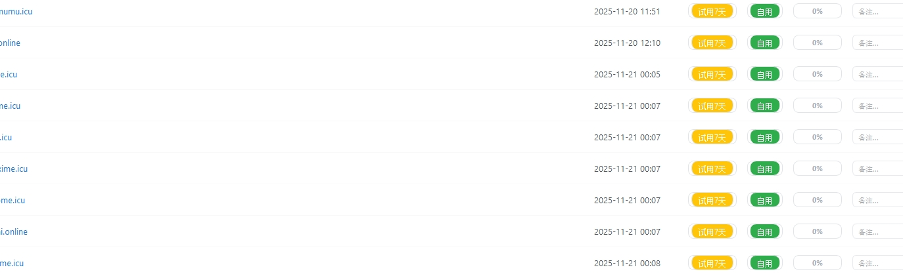

# 🎯 Cursor Pro 最新绑卡教程

<div align="center">


**稳定可靠 · 持续更新 · 专业支持**

[🚀 快速开始](#-快速开始) · [💬 加入群聊](#-联系我们) · [📖 教程文档](#-教程内容)

</div>

---

## ✨ 为什么选择我们？

| 特性 | 说明 |
|------|------|
| 🔥 **最新方法** | 2025年11月最新可用方案，告别失效教程 |
| ⚡ **快速上手** | 详细步骤指导，小白也能轻松搞定 |
| 🛡️ **稳定长久** | 经过实测验证，长期稳定使用 |
| 💡 **实时支持** | 专业技术团队在线答疑解惑 |
| 🔄 **持续更新** | 跟进官方变动，及时更新方案 |

## 📚 教程内容

### 🎓 完整教程包含

```
✅ Cursor Pro 订阅激活完整流程
✅ 虚拟卡申请与使用详解
✅ 常见问题排查与解决方案
✅ 安全注意事项与风险规避
✅ 后续续费操作指南
✅ 最新可用虚拟卡平台推荐
```

### 📋 详细步骤

1. **准备工作**
   - 注册Cursor账号
   - 准备虚拟卡平台账号
   - 了解基本流程

2. **虚拟卡申请**
   - 平台选择与注册
   - 充值与开卡
   - 卡片信息获取

3. **Cursor绑卡**
   - 登录Cursor官网
   - 进入订阅页面
   - 填写卡片信息
   - 完成订阅激活

4. **验证与使用**
   - 检查订阅状态
   - 开始使用Pro功能
   - 续费注意事项

## 🎁 加群即享

<div align="center">

### 加入我们的技术交流群

**QQ群：342072085**  
**群名：续杯超稳 7 群**



*扫码加群，开启你的Cursor Pro之旅！*

</div>

### 群内福利

- 📖 最新完整绑卡教程文档（图文+视频）
- 🎬 真人演示视频手把手教学
- 👥 技术交流群24小时实时答疑
- 🔔 第一时间获取方案更新通知
- 💳 推荐可靠的虚拟卡平台
- 🎯 独家优化方案和技巧分享

## 🚀 快速开始

### 方式一：加群获取（推荐）

加入QQ群 **342072085** 获取最新完整教程

### 方式二：自助学习

1. ⭐ Star 本仓库支持我们
2. 📥 克隆或下载本仓库
3. 📖 查看详细教程文档
4. 💬 遇到问题？加群咨询

## 💬 联系我们

- **QQ群**：342072085（续杯超稳 7 群）
- **GitHub Issues**：[提交问题](../../issues)
- **加群暗号**：cursor绑卡

## 📊 成功案例

> 💬 "教程非常详细，按照步骤操作，5分钟就搞定了！" - 用户A

> 💬 "群里的技术支持很给力，遇到问题马上就解决了。" - 用户B

> 💬 "已经稳定使用2个月了，非常满意！" - 用户C

## ⚠️ 重要提示

> 💡 **温馨提示**  
> - 本教程仅供学习交流使用
> - 请遵守相关法律法规和服务条款
> - 建议有条件的用户支持官方正版订阅
> - 使用虚拟卡需注意安全，选择可靠平台
> - 及时关注群内更新，避免方案失效

## 🔧 常见问题 FAQ

<details>
<summary><b>Q: 绑卡会不会有风险？</b></summary>
<br>
A: 使用正规虚拟卡平台，风险可控。建议选择群内推荐的可靠平台。
</details>

<details>
<summary><b>Q: 需要准备多少钱？</b></summary>
<br>
A: 通常需要支付Cursor订阅费用（约20美元/月）+ 虚拟卡开卡费用。
</details>

<details>
<summary><b>Q: 教程会过期吗？</b></summary>
<br>
A: 我们会持续跟进Cursor官方变动，及时更新教程。加入群聊可第一时间获取更新。
</details>

<details>
<summary><b>Q: 绑卡失败怎么办？</b></summary>
<br>
A: 加入QQ群，技术团队会协助你排查问题并提供解决方案。
</details>

<details>
<summary><b>Q: 可以多人共用一张卡吗？</b></summary>
<br>
A: 不建议。每个Cursor账号建议使用独立的虚拟卡。
</details>

## 📈 更新日志

- **2025.11.20** - 创建仓库，发布首个版本
- **持续更新中...** - 关注群聊获取最新动态

## 🌟 支持我们

如果这个教程对你有帮助，请：

- ⭐ 给本仓库点个Star
- 🔄 分享给有需要的朋友
- 💬 加入QQ群参与讨论
- 📝 提供反馈帮助我们改进

## 📜 免责声明

本项目仅用于技术学习和交流目的。使用本教程产生的任何后果由使用者自行承担。我们不对任何因使用本教程而产生的直接或间接损失负责。强烈建议有条件的用户通过官方渠道订阅Cursor Pro。

---

<div align="center">

**让AI编程更轻松，让开发效率翻倍！** 🚀

**Cursor Pro - 你的智能编程助手**

Made with ❤️ by 续杯超稳团队

[⬆ 回到顶部](#-cursor-pro-最新绑卡教程)

</div>
